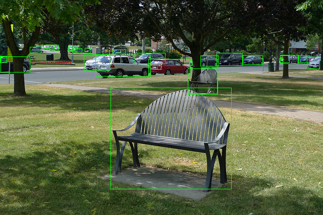

## Introduction

Safe MMDeploy Rust wrapper.

## Prerequisites

To make sure the building of this repo in success, you should install some pre-packages.

The following guidance is tested on Ubuntu OS on x86 device.

**Step 1.** Install Clang required by `Bindgen`.

```bash
apt install llvm-dev libclang-dev clang
```

**Step 2.** Download and install pre-built mmdeploy package. In this guidance, we choose a MMdepoloy prebuilt package target on ONNXRUNTIME-linux-x86.

```bash
wget https://github.com/open-mmlab/mmdeploy/releases/download/v0.8.0/mmdeploy-0.8.0-linux-x86_64-onnxruntime1.8.1.tar.gz
tar -zxvf mmdeploy-0.8.0-linux-x86_64-onnxruntime1.8.1.tar.gz
cd mmdeploy-0.8.0-linux-x86_64-onnxruntime1.8.1.tar.gz
export $MMDEPLOY_DIR=$(pwd)
```

**Step 3.** Install OpenCV required by examples.

```bash
apt install libopencv-dev
```


## Quickstart

Please read the previous section to make sure the required packages have been installed before using this crate.

Update your *Cargo.toml*

```toml
mmdeploy = "0.4.0"
```

## APIs for MM Codebases

Good news: Now, you can use Rust language to build your fantastic applications powered by MMDeploy!
Take a look by running some examples!

### Classifier API

Deploy image classification models converted by MMDeploy.

The example deploys a ResNet model converted by ONNXRUNTIME target on CPU device.

Before deploying, please follow the guidance from MMDeploy [documentation](https://mmdeploy.readthedocs.io/en/latest/get_started.html#convert-model) to install it and convert an appropriate model in `../mmdeploy_model/resnet`. An optional operation required to fetch MMClassification codebase into `../mmclassification/`. In this example, we use demo-image from it.

```bash
cargo run --example classifier cpu ../mmdeploy_model/resnet ../mmclassification/demo/dog.jpg
```

### Detector API

Deploy object detection models converted by MMDeploy.

The example deploys a FasterRCNN model converted by ONNXRUNTIME target on CPU device.

Before deploying, please follow the guidance from MMDeploy [documentation](https://mmdeploy.readthedocs.io/en/latest/get_started.html#convert-model) to install it and convert an appropriate model in `../mmdeploy_model/faster-rcnn-ort`. An optional operation required to fetch MMDetection codebase into `../mmdetection/`. In this example, we use demo-image from it.

```bash
cargo run --example detector cpu ../mmdeploy_model/faster-rcnn-ort ../mmdetection/demo/demo.jpg
```

A rendered result we can take a look located in the current directory and is named `output_detection.png`.



### Segmentor API

Deploy object segmentation models converted by MMDeploy.

The example deploys a DeepLabv3 model converted by ONNXRUNTIME target on CPU device.

Before deploying, please follow the guidance from MMDeploy [documentation](https://mmdeploy.readthedocs.io/en/latest/get_started.html#convert-model) to install it and convert an appropriate model in `../mmdeploy_model/deeplabv3`. An optional operation required to fetch MMSegmentation codebase into `../mmsegmentation/`. In this example, we use demo-image from it.

```bash
cargo run --example segmentor cpu ../mmdeploy_model/deeplabv3 ../mmsegmentation/demo/demo.png
```

A rendered result we can take a look located in the current directory and is named `output_segmentation.png`.


### TOSupport List

- [x] Classifier
- [x] Detector
- [x] Segmentor
- [ ] Pose Detector
- [ ] Rotated Detector
- [ ] Text Detector
- [ ] Text Recognizer
- [ ] Restorer