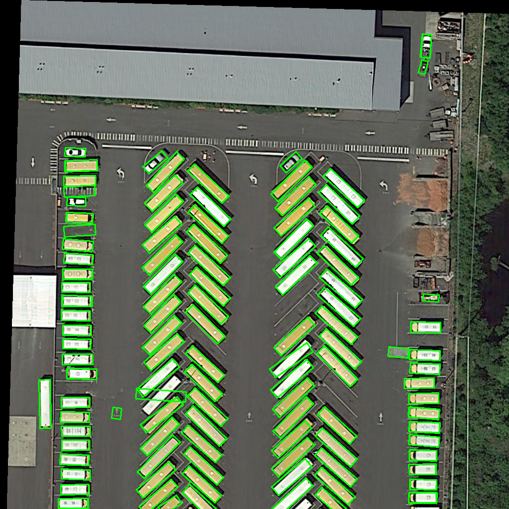

## Introduction

Safe MMDeploy Rust wrapper.

## Prerequisites

To make sure the building of this repo in success, you should install some pre-packages.

The following guidance is tested on Ubuntu OS on x86 device.

**Step 1.** Install Clang and Rust required by `Bindgen`.

```bash
apt install llvm-dev libclang-dev clang curl
curl --proto '=https' --tlsv1.2 https://sh.rustup.rs -sSf | sh
```

**Step 2.** Download and install pre-built mmdeploy package. In this guidance, we choose a MMdepoloy prebuilt package target on ONNXRUNTIME-linux-x86.

```bash
wget https://github.com/open-mmlab/mmdeploy/releases/download/v0.8.0/mmdeploy-0.8.0-linux-x86_64-onnxruntime1.8.1.tar.gz
tar -zxvf mmdeploy-0.8.0-linux-x86_64-onnxruntime1.8.1.tar.gz
cd mmdeploy-0.8.0-linux-x86_64-onnxruntime1.8.1
export MMDEPLOY_DIR=$(pwd)
export LD_LIBRARY_PATH=$MMDEPLOY_DIR/sdk/lib
```

**Step 3.** (Optional) Install OpenCV required by examples.

```bash
apt install libopencv-dev
```

**Step 4.** (Optional) Download ONNXRuntime prebuilt package and link required by examples.

```bash
wget https://github.com/microsoft/onnxruntime/releases/download/v1.8.1/onnxruntime-linux-x64-1.8.1.tgz
tar -zxvf onnxruntime-linux-x64-1.8.1.tgz
export ONNXRUNTIME_DIR=$(pwd)/onnxruntime-linux-x64-1.8.1
export LD_LIBRARY_PATH=$ONNXRUNTIME_DIR/lib:$LD_LIBRARY_PATH
```


## Quickstart

Please read the previous section to make sure the required packages have been installed before using this crate.

Update your *Cargo.toml*

```toml
mmdeploy = "0.8.0"
```

## APIs for MM Codebases

Good news: Now, you can use Rust language to build your fantastic applications powered by MMDeploy!
Take a look by running some examples!

### Classifier API

Deploy image classification models converted by MMDeploy.

The example deploys a ResNet model converted by ONNXRUNTIME target on CPU device.

Before deploying, please follow the guidance from MMDeploy [documentation](https://mmdeploy.readthedocs.io/en/latest/get_started.html#convert-model) to install it and convert an appropriate model in `../mmdeploy_model/resnet`. An optional operation required to fetch MMClassification codebase into `../mmclassification/`. In this example, we use demo-image from it.

```bash
cargo run --example classifier cpu ../mmdeploy_model/resnet ../mmclassification/demo/dog.jpg
```

### Detector API

Deploy object detection models converted by MMDeploy.

The example deploys a FasterRCNN model converted by ONNXRUNTIME target on CPU device.

Before deploying, please follow the guidance from MMDeploy [documentation](https://mmdeploy.readthedocs.io/en/latest/get_started.html#convert-model) to install it and convert an appropriate model in `../mmdeploy_model/faster-rcnn-ort`. An optional operation required to fetch MMDetection codebase into `../mmdetection/`. In this example, we use demo-image from it.

```bash
cargo run --example detector cpu ../mmdeploy_model/faster-rcnn-ort ../mmdetection/demo/demo.jpg
```

A rendered result we can take a look located in the current directory and is named `output_detection.png`.


### Segmentor API

Deploy object segmentation models converted by MMDeploy.

The example deploys a DeepLabv3 model converted by ONNXRUNTIME target on CPU device.

Before deploying, please follow the guidance from MMDeploy [documentation](https://mmdeploy.readthedocs.io/en/latest/get_started.html#convert-model) to install it and convert an appropriate model in `../mmdeploy_model/deeplabv3`. An optional operation required to fetch MMSegmentation codebase into `../mmsegmentation/`. In this example, we use demo-image from it.

```bash
cargo run --example segmentor cpu ../mmdeploy_model/deeplabv3 ../mmsegmentation/demo/demo.png
```

A rendered result we can take a look located in the current directory and is named `output_segmentation.png`.


### Pose detector API

Deploy pose detection models converted by MMDeploy.

The example deploys an HRNet model converted by ONNXRUNTIME target on CPU device.

Before deploying, please follow the guidance from MMDeploy [documentation](https://mmdeploy.readthedocs.io/en/latest/get_started.html#convert-model) to install it and convert an appropriate model in `../mmdeploy_model/hrnet`. An optional operation required to fetch MMPose codebase into `../mmpose/`. In this example, we use demo-image from it.

```bash
cargo run --example pose_detector cpu ../mmdeploy_model/hrnet ../mmdeploy/demo/resources/human-pose.jpg
```

A rendered result we can take a look located in the current directory and is named `output_pose.png`.


### Rotated detector API

Deploy rotated detection models converted by MMDeploy.

The example deploys a RetinaNet model converted by ONNXRUNTIME target on CPU device.

Before deploying, please follow the guidance from MMDeploy [documentation](https://mmdeploy.readthedocs.io/en/latest/get_started.html#convert-model) to install it and convert an appropriate model in `../mmdeploy_model/retinanet`. An optional operation required to fetch MMRotate codebase into `../mmrotate/`. In this example, we use demo-image from it.

```bash
cargo run --example rotated_detector cpu ../mmdeploy_model/retinanet ../mmrotate/demo/demo.jpg
```

A rendered result we can take a look located in the current directory and is named `output_rotated_detection.png`.



### OCR API

Deploy text detection and text recognition models converted by MMDeploy.

The example deploys a DBNet model for detection and a CRNN model for recognition both converted by ONNXRUNTIME target on CPU device.

Before deploying, please follow the guidance from MMDeploy [documentation](https://mmdeploy.readthedocs.io/en/latest/get_started.html#convert-model) to install it and convert appropriate models in `../mmdeploy_model/dbnet` and `../mmdeploy_model/crnn`. Optional operations required to fetch MMOCR codebase into `../mmocr/`. In this example, we use demo-image from it.

```bash
cargo run --example ocr cpu ../mmdeploy_model/dbnet ../mmdeploy_model/crnn ../mmocr/demo/demo_text_det.jpg
```

A rendered result we can take a look located in the current directory and is named `output_ocr.png`.


### Restorer API

Deploy restorer models converted by MMDeploy.

The example deploys an EDSR model for restoration converted by ONNXRUNTIME target on CPU device.

Before deploying, please follow the guidance from MMDeploy [documentation](https://mmdeploy.readthedocs.io/en/latest/get_started.html#convert-model) to install it and convert an appropriate model in `../mmdeploy_model/edsr`. Optional operations required to fetch MMEditing codebase into `../mmediting/`. In this example, we use demo-image from it.

```bash
cargo run --example restorer cpu ../mmdeploy_model/edsr ../mmediting/tests/data/lq/baboon_x4.png
```

A rendered result we can take a look located in the current directory and is named `output_restorer.png`.


### TOSupport List

- [x] Classifier
- [x] Detector
- [x] Segmentor
- [x] Pose Detector
- [x] Rotated Detector
- [x] Text Detector
- [x] Text Recognizer
- [x] Restorer

### TODO List

- [ ] PR for contributing a rust-mmdeploy-CI into MMDeploy
- [ ] Test with TensorRT prebuilt package
- [ ] Tutorial of rust-mmdeploy
- [ ] Documentation of rust-mmdeploy and rust-mmdeploy-sys
